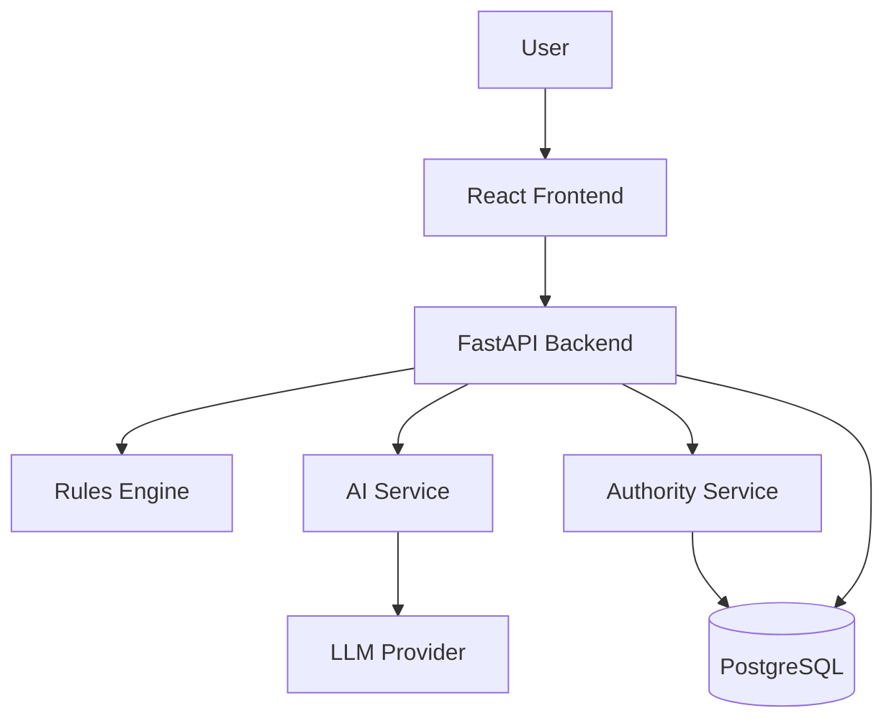
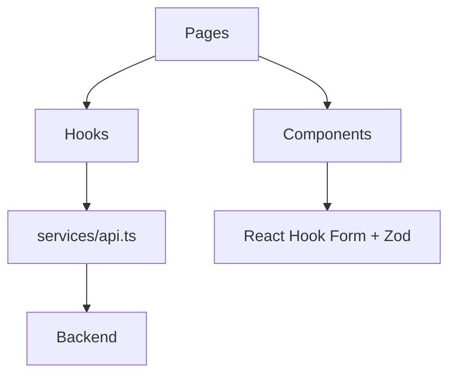
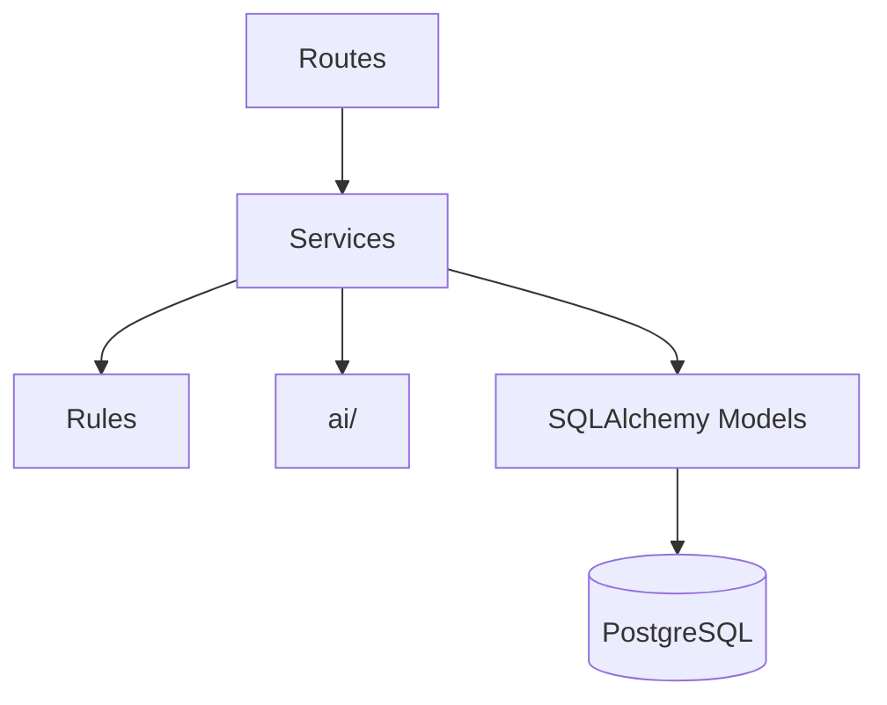
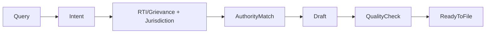
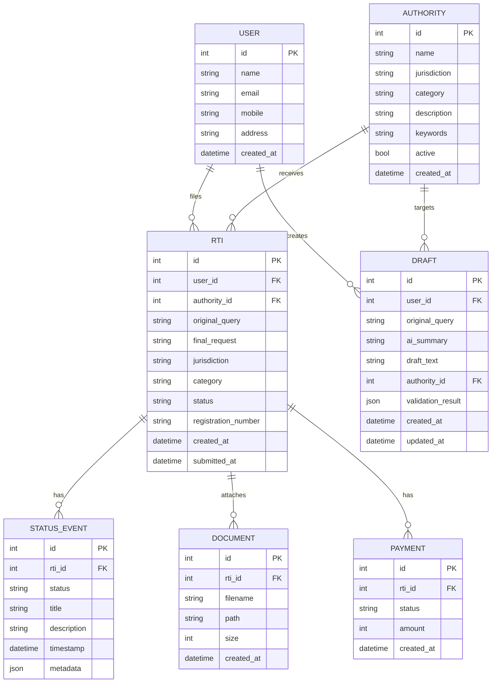

# RTI Navigator — Master Architecture & Product Spec

## 1. Product Definition

**Objective:** citizen types info-need, get routed, correct, filed RTI + tracked lifecycle. No bureaucracy knowledge needed.

**User:** first-time RTI filer, non-expert, confused by jurisdiction/wording/process.

**Core problem:** citizen no know if RTI right tool, which authority, how phrase, what happens after submit.

**Proposition:** intent → suitability → jurisdiction → authority → draft → quality check → file → track → next-action. All explained.

**MVP goal:** judge type real query, reach convincing simulated submission + tracking, unassisted.

**NOT:** not real govt backend. Not RTI Online replacement. Not legal advice. Not chatbot-only.

**Principles:**
- No fake govt claims. Always say "simulated."
- AI explain/draft, rules engine decide.
- Every AI output explainable, overridable.
- One full journey > many broken features.

**Why better than status quo:** turns 8-step confusing bureaucratic flow into 7-step guided conversation; explains jurisdiction/authority/next-action in plain language — RTI Online doesn't.

---

## 2. MVP Feature Set

### F1 — Intent Homepage
Purpose: capture natural language need.
Problem solved: no form-first friction.
Story: "As citizen, I type what I want in own words."
Flow: text box → submit → analysis state.
Input: free text. Output: structured intent JSON.
UI: single input, examples shown.
Backend: POST /intent/analyze → AI extract → validate.
AI: intent/category/entities/time extraction.
Deterministic: none yet.
Edge cases: empty input, gibberish, non-English mix.
Failure: AI timeout → fallback generic clarification.
Mocked: none. Real: AI call + validation.
Acceptance: valid JSON returned for 3 demo inputs 100% of time.

### F2 — RTI Suitability + Jurisdiction Check
Purpose: classify RTI vs grievance, Central vs State.
Problem: RTI Online only handles Central; users don't know.
Story: "As citizen, told upfront if RTI wrong tool or wrong jurisdiction."
Flow: intent JSON → rules engine classify → show verdict + explanation.
Input: intent JSON. Output: {is_rti, jurisdiction, explanation}.
UI: verdict card, plain-language reasoning.
Backend: rules/rti_classifier.py + rules/jurisdiction.py, deterministic keyword/category match.
AI: category hint only.
Deterministic: main logic — RTI-vs-grievance table, Central/State authority list.
Edge cases: ambiguous (mixed grievance+info request), unknown authority.
Failure: unknown → "needs manual review" state, don't guess confidently.
Mocked: none (rules real, curated data).
Acceptance: 3 demo scenarios classify correctly every run.

### F3 — Authority Finder
Purpose: recommend likely authority.
Problem: users don't know which ministry/dept.
Story: "As citizen, system suggests authority + reason, I can override."
Flow: category/keywords → curated DB lookup → rank candidates → top pick + confidence.
Input: category, entities. Output: {authority, reason, confidence}.
UI: recommended card + "choose manually" + "edit request."
Backend: authority_service.py, keyword/category retrieval + AI re-rank.
AI: ranking assist only, never sole decider.
Deterministic: keyword match against curated 20–50 authority DB.
Edge cases: no match, multiple equal matches.
Failure: low confidence → show top 3, ask user pick.
Mocked: DB curated not live. Real: matching logic.
Acceptance: correct authority in all 3 demo scenarios.

### F4 — RTI Draft Assistant
Purpose: turn vague ask into filed-request wording.
Problem: users don't know RTI phrasing conventions.
Story: "As citizen, get draft I can edit."
Flow: intent+authority → AI draft → explanation → accept/edit/regenerate.
Input: intent, authority. Output: {draft_text, explanation}.
UI: editable textarea + explanation panel.
Backend: drafting_service.py → AI provider → parse.
AI: primary generator.
Deterministic: template guardrails, no legal-advice framing enforced in prompt.
Edge cases: request asks for action not info (needs reframe), too vague.
Failure: AI fails → fallback template draft.
Mocked: none. Real: AI + fallback.
Acceptance: draft passes quality check for demo inputs.

### F5 — Request Quality Check
Purpose: pre-file validation.
Problem: incomplete requests rejected/ delayed.
Story: "As citizen, told exactly what's missing before submit."
Flow: draft → validation_service → checklist UI.
Input: draft text. Output: {valid, checks{}, warnings[]}.
UI: checklist ✓/⚠ with actionable fix text.
Backend: rules/validation_rules.py — char limit (3000), required fields, specificity heuristic.
AI: optional specificity suggestion.
Deterministic: char count, field presence — real logic.
Edge cases: exactly at char limit, no time period given.
Failure: none blocking — warnings only, "specific date" nudge.
Mocked: none. Real.
Acceptance: warnings shown correctly per demo case.

### F6 — Guided Filing
Purpose: applicant details → docs → payment → review → submit.
Problem: current portal fragments this into confusing steps.
Story: "As citizen, one guided stepper."
Flow: stepper form, each step validated (Zod + Pydantic).
Input: synthetic applicant data, mock doc, mock OTP, mock ₹10 payment.
Output: RTI record created, state → SUBMITTED.
UI: multi-step form, React Hook Form.
Backend: rti_service.py, payment_service.py (mocked), submission generates registration number.
AI: none.
Deterministic: state machine transitions.
Edge cases: payment fail, OTP fail, doc too large.
Failure: payment fail → PAYMENT_FAILED state, retry option; never claim success falsely.
Mocked: OTP, payment, doc storage, govt submission. Real: form logic, state transitions, DB writes.
Acceptance: full demo flow reaches SUBMITTED state.

### F7 — Case Dashboard + Status Timeline
Purpose: list + detail view of RTI cases w/ plain-language timeline.
Problem: RTI Online status codes are cryptic.
Story: "As citizen, see human-readable timeline."
Flow: GET /rtis (list), GET /rtis/{id} (detail+events).
Input: user_id. Output: list, status_events[].
UI: card list + vertical timeline with ✓/●/○.
Backend: status_service.py reads StatusEvent table.
AI: none.
Deterministic: event ordering, current-state derivation.
Edge cases: no events yet, case not found.
Failure: 404 handled gracefully.
Mocked: status transitions are simulated/synthetic. Real: query/render logic.
Acceptance: 3 demo cases show correct timelines.

### F8 — "What Happens Next?"
Purpose: always give next action or explicit "none needed."
Problem: RTI Online doesn't guide next step.
Story: "As citizen, always know what to do."
Flow: derive from current status via rules table.
Input: status. Output: next_action text.
Backend: rules/next_action logic in status_service.
AI: none required (optional response-completeness checker later).
Deterministic: status→action mapping table.
Edge cases: overdue response, additional fee requested.
Failure: unmapped status → generic "check back later."
Mocked: scenario data. Real: mapping logic.
Acceptance: correct next-action text per state in all demos.

---

## 3. Feature Boundaries

**Must-have (P0):** F1–F8 core paths, demo 3 scenarios, mock payment/OTP/submission, dashboard, timeline, next-action.

**Nice-to-have (P1/P2, only if ahead):** response completeness checker, more authorities (>50), draft autosave, better mobile polish, demo reset endpoint (actually P0 — see below).

**Out of scope (explicit):**
- Live RTI Online API — no access, no partnership → future V3.
- Real payment/OTP — compliance/security risk → future, needs licensed gateway.
- WhatsApp/voice — extra channel complexity → V2+.
- Multilingual — scope/time → V2.
- Nationwide authority DB — curation cost → V2.
- Automatic legal advice — liability → never automated, always "not legal advice."
- First/Second Appeal automation — needs real status data → V4/V5.
- Govt officer dashboard — different product surface → V7.
- Existing-RTI/document search — needs corpus → V6.
- Native mobile — responsive web sufficient for MVP → future.

---

## 4. Future Roadmap

**V2 — Better Filing:** autosave, bigger authority DB, better matching, multilingual, accessibility, real auth if available. Not in MVP: time cost. MVP support: authority schema already extensible, i18n-ready component structure recommended now.

**V3 — Real Status Lifecycle:** swap mock status source for real govt adapter behind same StatusEvent interface. Not in MVP: no API access. MVP support: status_service abstracts source already.

**V4 — Response Intelligence:** PDF extraction, response-vs-request comparison, missing-info detection. Not in MVP: needs stable core first. MVP support: Draft model stores original request items for later comparison.

**V5 — Appeals:** First/Second Appeal flows chained off RESPONSE_RECEIVED / overdue states. Not in MVP: depends on real status. MVP support: state machine already includes APPEAL_AVAILABLE transition.

**V6 — Info Discovery:** pre-file check against public data/reports. Not in MVP: no corpus. MVP support: none needed yet, future search service slots into architecture as new service.

**V7 — Govt-side workflow:** authority dashboard for officers. Not in MVP: wrong product surface. MVP support: none required.

---

## 5. System Architecture

### A. High-Level


### B. Frontend


### C. Backend


### D. AI


### E. Database — see section 8 ER diagram.

### F. State Machine — see section 13.

### G. Drafting Pipeline


### H. Submission/Status Pipeline


---

## 6. Technology Stack

**Frontend:** React + TypeScript + Vite + React Router + Tailwind + TanStack Query + React Hook Form + Zod.
Why: team knows it, fast hackathon setup, TanStack handles caching/retries, RHF+Zod handles multi-step form validation matching backend schemas.

**Backend:** FastAPI + Python.
Why: Python-native AI ecosystem, Pydantic schemas, auto OpenAPI docs, fast dev, team familiar. Don't over-engineer: no microservices, no GraphQL.

**DB:** PostgreSQL (not SQLite).
Why: relational fit, JSON fields where needed, realistic prod path. Don't over-engineer: no sharding/replication for hackathon.

**ORM/migrations:** SQLAlchemy + Alembic. Don't hand-edit schema.

**Auth:** simplified — single synthetic user or basic session, no real identity verification.

**File handling:** local temp storage, size/type validated. Don't build cloud storage now.

**AI SDK:** internal AIService abstraction over provider adapter (Anthropic/OpenAI-agnostic). Don't hardcode provider calls in routes.

**Docker:** docker-compose (api + postgres) for reproducible dev.

**Testing:** pytest (backend), Vitest/RTL (frontend), one e2e script for demo path.

**Deployment:** simple hosted frontend (Vercel/Netlify-style) + backend container + managed Postgres. Keep hackathon-realistic, no k8s.

---

## 7. Repository Structure

```
rti-navigator/
├── frontend/
│   ├── src/
│   │   ├── app/ (router, providers)
│   │   ├── pages/ (Home, Intent, Authority, Draft, Review, Filing, Payment, Confirmation, Dashboard, RTIDetails)
│   │   ├── components/ (common, forms, rti, timeline, feedback)
│   │   ├── services/api.ts
│   │   ├── hooks/, types/, utils/, styles/
│   └── package.json
├── backend/
│   ├── app/
│   │   ├── main.py
│   │   ├── api/routes/ (intent, authority, draft, validation, rti, payment, status)
│   │   ├── models/ (user, authority, rti, status_event, draft)
│   │   ├── schemas/
│   │   ├── services/
│   │   ├── rules/ (jurisdiction, rti_classifier, validation_rules)
│   │   ├── ai/ (interface, provider, prompts/, parsers)
│   │   ├── db/ (database, migrations)
│   │   └── config.py
│   ├── tests/
│   ├── requirements.txt
│   └── Dockerfile
├── docs/
├── docker-compose.yml
├── README.md
└── .gitignore
```
API layer thin; business logic lives in services; rules/AI/DB separated per architecture principle (API→Service→Rules/AI/DB).

---

## 8. Database Design



Simplify for hackathon: DOCUMENT/PAYMENT can be minimal (few columns); USER can skip auth fields.

---

## 9. API Design (core endpoints)

`POST /api/v1/intent/analyze` — Person1/Intent service. No auth required MVP.
Req: `{"text": "..."}` Res: `{"is_rti":true,"category":"health","jurisdiction":"central","summary":"...","missing_information":[]}`
Errors: 422 empty text, 502 AI failure (fallback used).

`POST /api/v1/authorities/recommend` — Authority service.
Res: `{"authority_id":12,"name":"Ministry of Health and Family Welfare","reason":"...","confidence":"high"}`

`POST /api/v1/drafts/generate` — Drafting service.
Res: `{"draft":"Please provide...","explanation":"...","missing_information":[]}`

`POST /api/v1/drafts/validate` — Validation service.
Res: `{"valid":true,"checks":{...},"warnings":[]}`

`POST /api/v1/rtis` — create RTI (Person2). Body: validated RTI object (see integration contract).

`POST /api/v1/rtis/{id}/payment` — mock payment. Res: `{"status":"success","amount":10}`. Failure: `{"status":"failed"}`.

`POST /api/v1/rtis/{id}/submit` — Res: `{"registration_number":"RTI/2026/00124","status":"SUBMITTED"}`.

`GET /api/v1/rtis/{id}` — full case + status_events.

`GET /api/v1/rtis` — dashboard list.

`POST /api/v1/documents` — mock upload, size/type validated.

`POST /api/v1/demo/reset` — dev-only, resets to known demo state (critical for live demo).

---

## 10. AI Architecture

AI does: intent extraction, missing-info detection, draft generation/explanation, (optional) response completeness later.
AI does NOT: decide jurisdiction, decide final authority alone, claim submission success, give legal certainty.

Pipeline: query → normalize → intent extraction → structured JSON → rules engine → authority retrieval → AI draft gen → deterministic validation → final draft.

Structured output schema (example):
```json
{"intent":"government_expenditure_information","category":"health","jurisdiction_hint":"central","entities":["government hospitals"],"time_period":"2025","needs_clarification":false}
```
Backend validates every field against Pydantic schema; reject/repair malformed JSON.

Fallback: AI request → LLM → validate structured output → valid? yes→use : no→deterministic fallback response. Keep fallback outputs for 3 demo scenarios pre-written.

Prompts versioned under `ai/prompts/*_v1.txt`, each stating role/task/schema/constraints/prohibited claims (no real submission, no legal advice, no live status).

Explainability: every recommendation ships with a plain-language reason field, always overridable by user.

---

## 11. Authority Finder Architecture

Schema: id, name, jurisdiction, category, description, keywords, active.
Matching: query → AI extracts category/entities → keyword/category retrieval against curated 20–50 authority DB → candidate list → AI/rule ranking → top pick + confidence (high/med/low).
Low confidence: show top 3, force manual choice, no confident guess.
Example: "Ministry of Health spent on hospitals 2025" → category=health, jurisdiction=central → match "Ministry of Health and Family Welfare" → confidence high.

---

## 12. Rules Engine

Lives in `backend/app/rules/`.
- RTI vs grievance: `rti_classifier.py`, keyword/intent table.
- Central vs State: `jurisdiction.py`, authority-jurisdiction lookup.
- Char limit (3000), required fields, specificity: `validation_rules.py`.
- BPL fee logic: validation_rules.py (if included).
- Payment states, RTI status transitions, next-action: `status_service.py` using state table.

---

## 13. RTI State Machine

| State | Meaning | Transitions | Trigger | Citizen text | Next action | Real/Simulated |
|---|---|---|---|---|---|---|
| DRAFT | drafting | →READY_TO_FILE | quality check pass | "Draft in progress" | complete draft | Real |
| READY_TO_FILE | validated | →PAYMENT_PENDING | user proceeds | "Ready to file" | start filing | Real |
| PAYMENT_PENDING | awaiting pay | →PAYMENT_SUCCESS/FAILED | mock payment | "Processing payment" | wait | Simulated |
| PAYMENT_FAILED | failed | →PAYMENT_PENDING | retry | "Payment failed" | retry payment | Simulated |
| PAYMENT_SUCCESS | paid | →SUBMITTED | auto | "Payment confirmed" | none | Simulated |
| SUBMITTED | filed | →RECEIVED | auto | "Application submitted" | none | Simulated |
| RECEIVED | ack | →FORWARDED | auto/demo timer | "Received by portal" | none | Simulated |
| FORWARDED | routed | →AWAITING_RESPONSE | auto | "Forwarded to authority" | none | Simulated |
| AWAITING_RESPONSE | pending | →RESPONSE_RECEIVED/ADDITIONAL_FEE | demo scenario | "No action required" | wait / check overdue | Simulated |
| ADDITIONAL_FEE | fee requested | →AWAITING_RESPONSE | demo scenario | "Additional fee requested" | pay fee | Simulated |
| RESPONSE_RECEIVED | got reply | →APPEAL_AVAILABLE/COMPLETED | demo scenario | "Response available" | review response | Simulated |
| APPEAL_AVAILABLE | can appeal | →COMPLETED | user action | "Appeal window open" | file first appeal (future) | Simulated |
| COMPLETED | done | — | — | "Case closed" | none | Simulated |

---

## 14. Error Handling

- AI failure/invalid output → deterministic fallback, log, never block flow.
- Authority not found → manual selection required, no guess.
- Ambiguous request → ask clarifying question, don't force classification.
- Wrong jurisdiction → explicit message, no fake routing.
- Payment failure → PAYMENT_FAILED, retry, no false success.
- Payment deducted, confirmation pending → explicit "pending" state, never silently mark success.
- DB failure → 500, generic user message, no partial writes (use transactions).
- Doc upload failure → size/type error surfaced immediately.
- Submission failure → stay in PAYMENT_SUCCESS, retry submit, never fabricate registration number.
- Timeout/network → retry w/ backoff (TanStack Query), user-visible loading/error state.

Golden rule: never claim real government action occurred when simulated.

---

## 15. Security & Privacy

- Secrets via env vars, never in Git.
- Pydantic input validation everywhere; file type/size checks.
- No real Aadhaar/PAN/bank/OTP/govt creds — synthetic only.
- AI receives request text only, not applicant PII.
- No raw user data in logs; log request_id/endpoint/status/latency only.
- CORS restricted to frontend origin.
- Basic auth/session sufficient for MVP; no rate limiting needed at hackathon scale (add if time permits).

---

## 16. Testing Strategy

Unit: RTI classification, jurisdiction rules, authority matching, char count/validation (Person1); status transitions, payment states, registration generation, dashboard queries, next-action logic (Person2).
Integration: draft→validate→create RTI→payment→submit→status.
E2E: full primary demo journey scripted, run before every build.
AI output tests: schema validation against sample structured outputs + fallback trigger test.
Critical paths before submission: all 3 demo scenarios end-to-end, payment failure path, unknown-authority path.

---

## 17. Deployment Architecture

Local: docker-compose (api + postgres), frontend via Vite dev server.
Frontend: static host (Vercel/Netlify-style build).
Backend: single container, env-configured (DATABASE_URL, LLM_API_KEY, CORS_ORIGINS).
Postgres: managed instance or container, migrations via Alembic on startup.
Demo config: seeded via `/api/v1/demo/reset` before each presentation run.

---

## 18. Demo Architecture

3–5 min judge demo, 3 scripted scenarios:

1. **Ideal journey:** "How much did Ministry of Health spend on government hospitals in 2025?" → central, health → Ministry of Health and Family Welfare (high confidence) → draft generated → quality check passes → file → mock payment → registration number → dashboard → timeline → "no action required."
2. **Wrong jurisdiction:** Karnataka state hospital expenditure → flagged as State, not RTI Online-appropriate, explained.
3. **Bad request reformulation:** "Why hasn't the government built this hospital?" → flagged as needing reformulation → system suggests record-based request.

Pre-seeded: authority DB, 3 demo cases in DB via reset endpoint. Live: intent screen input, draft generation (with fallback ready). Deterministic: all status transitions, registration numbers. Mocked and stated as such on-screen ("Government submission simulated for prototype").
Strongest innovation to highlight: authority explainability + jurisdiction check + next-action guidance — things RTI Online doesn't do today.

---

## 19. Implementation Priorities

P0: F1–F8 core flow, curated authority DB (20–50), 3 demo scenarios, mock payment/OTP/submission, demo reset endpoint, state machine, dashboard/timeline/next-action.
P1: AI fallback robustness, validation polish, error states, mobile responsiveness.
P2 (only if ahead): response completeness checker, draft autosave, more authorities.
P3 (future): everything in section 4 roadmap.

---

## 20. Architectural Decisions

- **FastAPI over Node:** Python-native AI ecosystem, team familiarity, fast schema/docs via Pydantic.
- **PostgreSQL over SQLite:** relational fit for status/event data, closer to real deployment, negligible extra hackathon cost.
- **Monolith over microservices:** 2 devs, 1 week — service boundaries (modules) give same clarity without ops overhead.
- **AI + rules, not AI-only:** government-process decisions need determinism/auditability; AI alone risks hallucinated jurisdiction/authority claims.
- **Curated authority data over live discovery:** no government API access; curated 20–50 entries sufficient to demo credibly.
- **Simulated government integration:** no real access possible; always labeled "simulated" to preserve trust/ethics.
- **Event-based status history over single status field:** naturally supports timeline UI, extensible for real integration later.
- **REST over GraphQL:** simplicity, FastAPI native fit, no need for flexible querying at this scale.
- **No real payment integration:** compliance/security burden not justified for demo; mock ₹10 payment sufficient.
- **No native mobile:** responsive web meets timeline; native app is separate scope (V-future).
